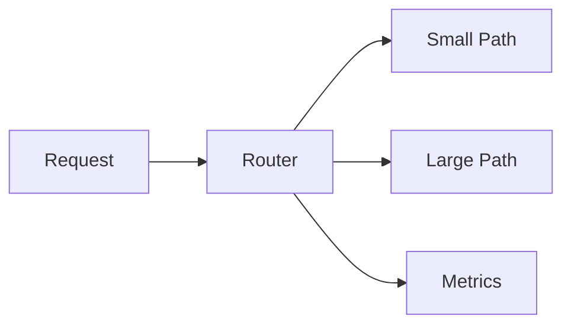
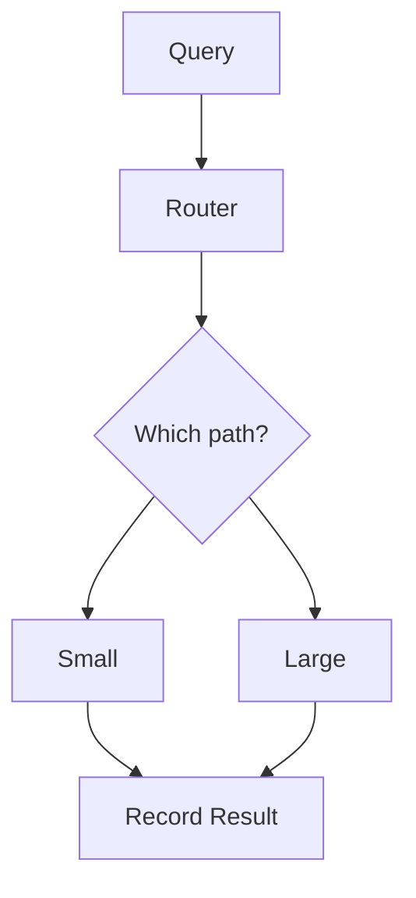

# JevRev

JevRev is a small research project for benchmarking **Jev-based AI routing** against deterministic and LLM-based approaches.

## Goal

> Can a lightweight decision layer route requests to the cheapest capable execution path without meaningfully hurting quality?

The initial experiment compares:
- a small LLM used as the router
- a large LLM used as the router
- Jev used as the router

A deterministic keyword router is also available as a non-LLM baseline.

## Current status

- [x] Repository and benchmark fixture
- [x] Routing baseline
- [x] Metrics foundation
- [x] Provider abstraction
- [x] Jev API adapter + model discovery
- [x] Unified Jev / LLM benchmark runner
- [x] Usage-based cost accounting
- [ ] Expanded evaluation dataset
- [ ] Repeated latency trials
- [ ] End-to-end execution-quality benchmark
- [ ] Final benchmark report

## Architecture



## Benchmark Overview


## Simple Routing Flow



## Run

Copy `.env.example` and set the credentials/configuration locally. Never commit API keys.

For Jev, set `TYPESAFE_API_KEY`. The client defaults to `jev-latest`, which is also discoverable through TypeSafe's `GET /v1/models` endpoint.

For the LLM baselines, set:
- `LLM_API_KEY`
- `LLM_API_BASE_URL`
- `SMALL_MODEL`
- `LARGE_MODEL`
- `LLM_INPUT_PRICE_PER_MTOK`
- `LLM_OUTPUT_PRICE_PER_MTOK`

Then run:

```bash
python run_benchmark.py
```

By default the runner executes `jev,small,large`. To include the deterministic baseline:

```bash
BENCHMARK_STRATEGIES=jev,small,large,keyword python run_benchmark.py
```

The runner reports **routing accuracy**, measured latency, estimated cost from reported token usage, and the number of `large` routes.

## Metrics

- route accuracy against the fixed benchmark labels
- mean measured latency
- estimated inference cost
- large-model route count
- later: end-to-end execution quality and fallback rate

## Research principles

This is an experiment, not a claim that Jev is universally better. Results must use the same workload and document model versions, pricing assumptions, and trial conditions. Do not fabricate missing measurements. Negative results are valid results.

## License

MIT
